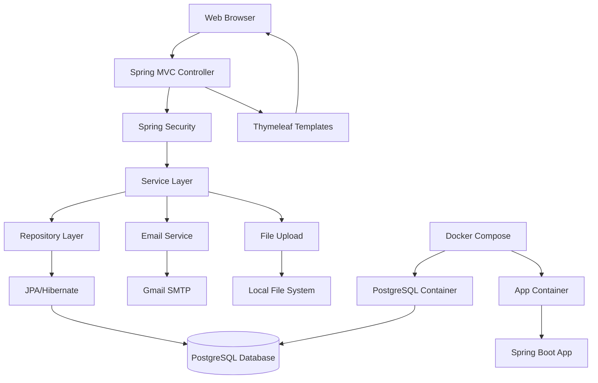

# AmarDokan - E-Commerce Application

## Project Description

AmarDokan is a comprehensive e-commerce web application built as a group project for Software Engineering and Project Management course. The application provides a platform for users to browse products, manage shopping carts, place orders, and for administrators to manage products, categories, and user accounts. The system includes user authentication, product catalog management, order processing, and email notifications.

## Technology Stack

### Backend
- **Java 21** - Programming language
- **Spring Boot 3.5.11** - Framework for building the application
- **Spring Data JPA** - Data access layer
- **Spring Security** - Authentication and authorization
- **Spring Mail** - Email functionality
- **PostgreSQL** - Primary database
- **H2 Database** - Test database

### Frontend
- **Thymeleaf** - Server-side templating engine
- **HTML5/CSS3/JavaScript** - Frontend technologies
- **Bootstrap** - CSS framework (via custom styles)

### DevOps & Tools
- **Maven** - Build automation and dependency management
- **Docker & Docker Compose** - Containerization
- **GitHub Actions** - CI/CD pipeline
- **Lombok** - Code generation library

## Architecture Diagram



### Architecture Overview
- **Presentation Layer**: Thymeleaf templates with MVC controllers
- **Business Logic Layer**: Service classes handling application logic
- **Data Access Layer**: Repository interfaces with JPA implementation
- **Security Layer**: Spring Security for authentication and authorization
- **Infrastructure**: Docker containers for deployment, PostgreSQL for data persistence

## API Endpoints

### Products API (`/api/products`)
- `GET /api/products` - Retrieve all products
- `GET /api/products/{id}` - Retrieve product by ID
- `POST /api/products` - Create new product (with image upload)
- `PUT /api/products/{id}` - Update existing product
- `DELETE /api/products/{id}` - Delete product

### Categories API (`/api/categories`)
- `GET /api/categories` - Retrieve all categories
- `GET /api/categories/{id}` - Retrieve category by ID
- `POST /api/categories` - Create new category (with image upload)
- `PUT /api/categories/{id}` - Update existing category
- `DELETE /api/categories/{id}` - Delete category

### Users API (`/api/users`)
- `GET /api/users` - Retrieve all users (optional role filter)
- `GET /api/users/{email}` - Retrieve user by email
- `POST /api/users` - Create new user
- `PUT /api/users/{id}/status` - Update user account status

## Run Instructions

### Prerequisites
- Java 21 or higher
- Maven 3.6+
- Docker and Docker Compose (for containerized deployment)
- PostgreSQL (if running locally without Docker)

### Local Development Setup

1. **Clone the repository**
   ```bash
   git clone <repository-url>
   cd amarDokan
   ```

2. **Configure Environment Variables**
   
   Create a `.env` file in the root directory:
   ```env
   DATABASE_URL=jdbc:postgresql://localhost:5432/amardokan
   DATABASE_USER=your_db_user
   DATABASE_PASSWORD=your_db_password
   MAIL_USERNAME=your_gmail@gmail.com
   MAIL_PASSWORD=your_gmail_app_password
   IMAGE_UPLOAD_PATH=uploads/img
   PORT=8081
   ```

3. **Using Docker Compose (Recommended)**
   ```bash
   # Start PostgreSQL database
   docker-compose up postgres -d
   
   # Run the application
   ./mvnw spring-boot:run
   ```

4. **Using Docker Compose (Full Stack)**
   ```bash
   docker-compose up --build
   ```
   The application will be available at `http://localhost:8081`

5. **Manual Setup**
   ```bash
   # Install dependencies
   ./mvnw clean install
   
   # Run the application
   ./mvnw spring-boot:run
   ```

### Default Admin Credentials
- **Username**: admin
- **Password**: admin123

## CI/CD Pipeline

The project uses GitHub Actions for continuous integration and deployment. The CI/CD pipeline is configured in `.github/workflows/maven.yml` and includes:

### Triggers
- Push to `main`, `develop`, or any `feature/**` branch
- Pull requests targeting `main` or `develop` branches

### Pipeline Steps
1. **Checkout Code**: Retrieves the latest code from the repository
2. **Setup JDK 21**: Configures Java 21 with Eclipse Temurin distribution
3. **Cache Maven Dependencies**: Speeds up builds by caching dependencies
4. **Make Maven Wrapper Executable**: Ensures the Maven wrapper script is executable
5. **Build and Test**: Runs `mvn test` to compile and execute unit tests
6. **Upload Test Reports**: Archives JUnit test results as artifacts

### Benefits
- **Automated Testing**: Ensures code quality with every push
- **Fast Feedback**: Quick identification of build failures
- **Consistent Environment**: Standardized build environment across all runs
- **Artifact Storage**: Test reports available for download and analysis

## Project Structure

```
amarDokan/
├── src/
│   ├── main/
│   │   ├── java/com/amarDokan/amarDokan/
│   │   │   ├── controller/          # MVC and REST controllers
│   │   │   ├── dto/                 # Data transfer objects
│   │   │   ├── exception/           # Custom exceptions
│   │   │   ├── mapper/              # Object mappers
│   │   │   ├── models/              # JPA entities
│   │   │   ├── repository/          # Data repositories
│   │   │   ├── service/             # Business logic services
│   │   │   └── util/                # Utility classes
│   │   └── resources/
│   │       ├── static/              # CSS, JS, images
│   │       ├── templates/           # Thymeleaf templates
│   │       └── application.properties
│   └── test/                        # Unit and integration tests
├── .github/workflows/               # CI/CD configuration
├── uploads/                         # File upload directory
├── Dockerfile                       # Docker image configuration
├── compose.yaml                     # Docker Compose setup
├── pom.xml                          # Maven configuration
└── README.md                        # This file
```

